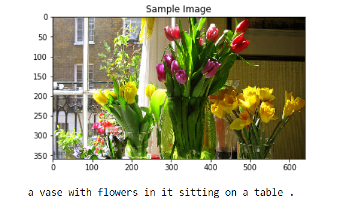
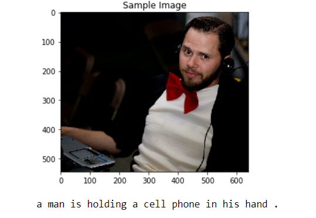
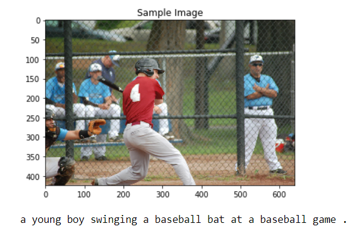
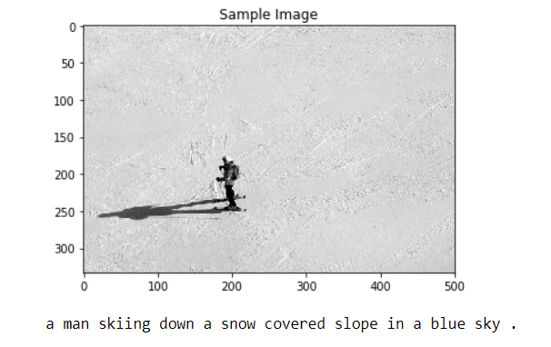
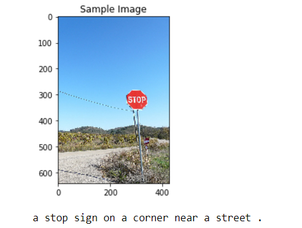

# Image captioning
Code inspired by Udacity's Computer vision nanodegree project on image captioning.

## Predicted Captions

   

   

   

   

       

## Credit
Most of the code is based on the Udacity code for CNN models, RNN models and Image Captioning.
